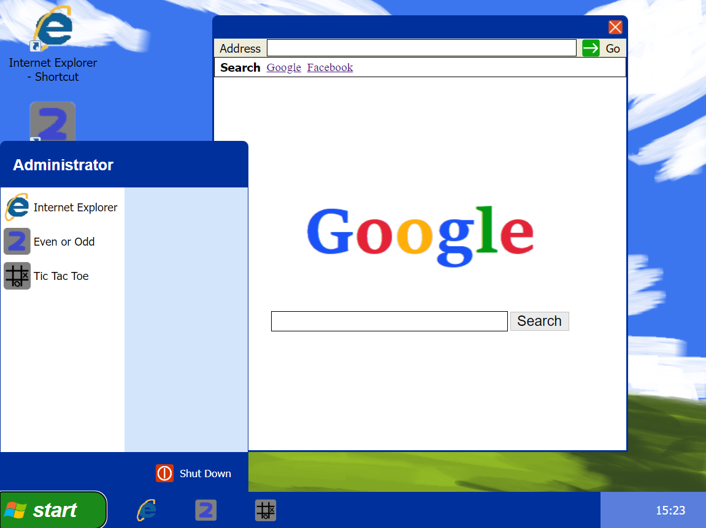

# FakeOS

## Snippets



## Description

FakeOS is a web application that simulates an operating system interface. The project aims to help explore and consolidate my understanding of HTML, CSS, and JavaScript by replicating the layout and format of a given design. The application features a wallpaper that scales to fit the viewport, selectable icons, a menu, and a display for the current time. When an icon is selected, it will open an "app" in a modal, which can also be closed.

### Tech Stack

- HTML
- CSS (SCSS)
- JavaScript

## Features

- SPA (Single Page Application) structure.
- Selectable icons that open apps in modals.
- Functional apps.
- Selectable menu displaying a list of text and icons.
- Display of the current time.

## Build Steps

1.  Clone the repository.

```shell
git clone https://github.com/Abbby3/FakeOS
```

2.  Navigate to the project directory.

```shell
cd FakeOS
```

3.  Open the application.

```shell
start index.html
```
